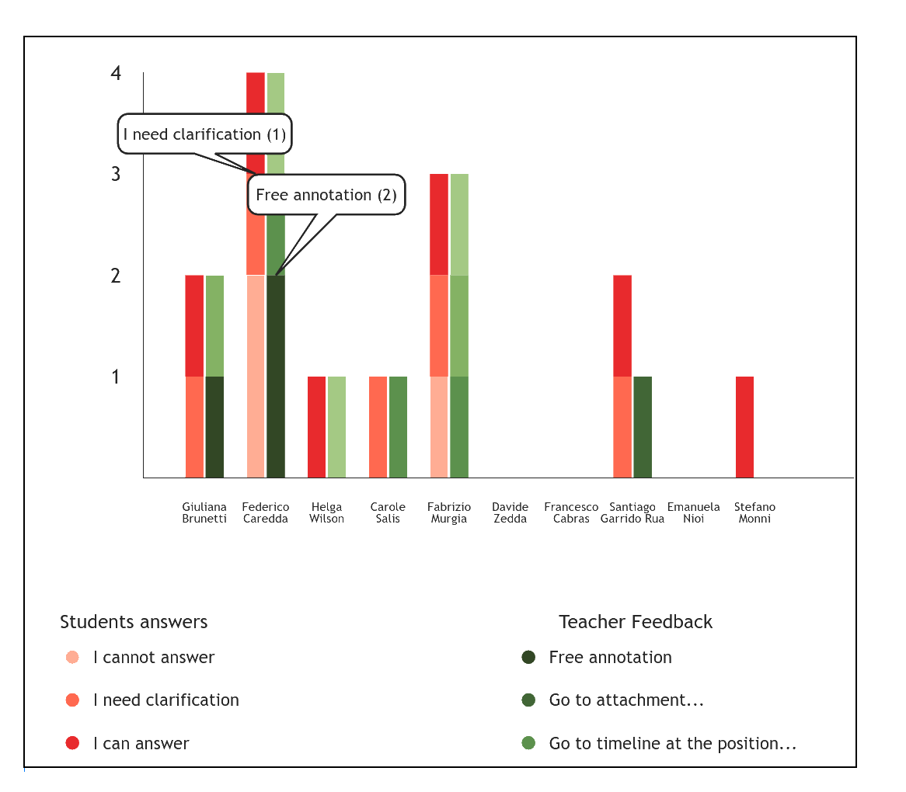
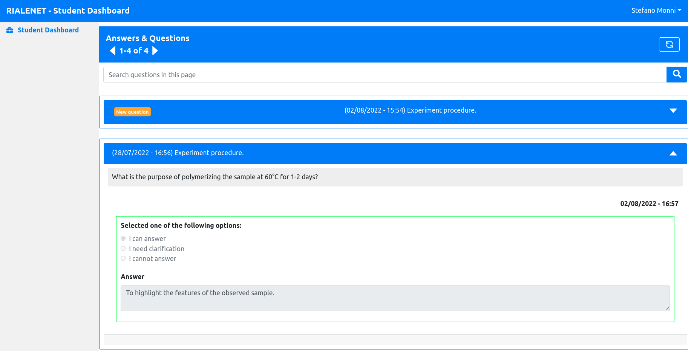

# rialenet_frontend
This project includes the source code of the frontend of the  [Rialenet Platform](https://github.com/crs4/rialenet/). To get more informations about the project, please [visit this page](https://www.crs4.it/projectdetails/RIALENET/).  

<b>Transactions Summary</b>

<b>Student Answers</b>

